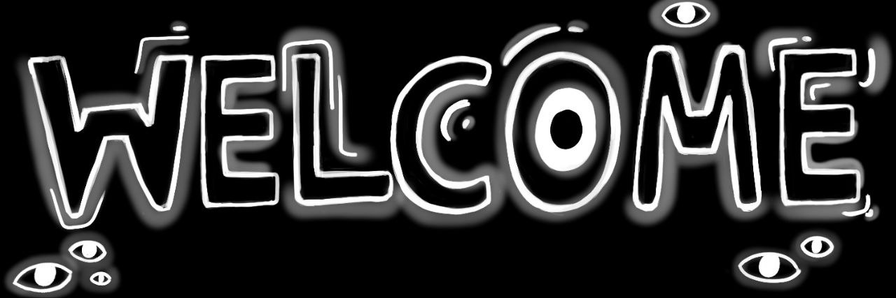
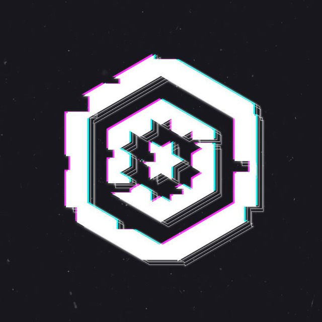

<!DOCTYPE html>
<html>
<body>
 <!-- Created based on https://github.com/xXxCLOTIxXx/xXxCLOTIxXx?tab=readme-ov-file -->
    <h1 align="center"></h1> 
    

        
         
        
         
         
        
         
    

    

<h1>My Projects</h1>
        <ul>
         
            <li>
                
            </li>
            <li>
                
            </li>
            <li>
                
            </li>
            <li>
                
            </li>
           <li>
                
            </li>
           <li>
                
            </li>
        </ul>
        <h1>
            My knowledge
        </h1>
        
        
        
        
        
        
    

</body>
<html>
